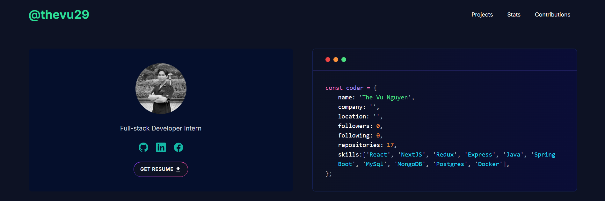

# 📌 Portfolio

Welcome to my personal portfolio! This repository showcases my skills, projects, and experiences in web development and software engineering.

## 📖 About Me
I am a passionate software developer with expertise in building scalable, user-friendly applications. My portfolio demonstrates my ability to solve problems, write clean code, and continuously learn new technologies.

## 🚀 Features
- Responsive Design: Optimized for all screen sizes (desktop, tablet, mobile).
- Dynamic Content: Showcases projects with real-time updates.
- Interactive UI: Smooth navigation and animations.
- SEO Friendly: Enhanced for search engine visibility.

## 📂 Project Structure
```
├── public/          # Static files (e.g., images, fonts)
├── src/
│   ├── app/         # App Router (Next.js 14)
│   ├── components/  # Reusable components
│   ├── hooks/       # Custom hooks
│   ├── styles/      # CSS/Sass styles
│   └── utils/       # Utility functions
├── .env             # Environment variables
├── next.config.js   # Next.js configuration
├── package.json     # Dependencies & scripts
└── README.md        # Project documentation
```

## 🛠️ Technologies Used
- **Framework:** Next.js 14 (App Router)
- **Frontend:** React, TypeScript, TailwindCSS
- **Backend:** Node.js (Optional: API routes with Next.js)
- **Deployment:** Vercel/Netlify (for live hosting)
- **Tools:** Git, ESLint, Prettier, React Testing Library

## 📸 Screenshots


## 📦 Installation
1. Clone the repository:

   ```bash
   git clone https://github.com/thevu29/my-portfolio.git
   ```

2. Navigate to the project directory:

   ```bash
   cd portfolio
   ```

3. Install dependencies:

   ```bash
   npm install
   # or
   yarn install
   ```

4. Start the development server:

   ```bash
   npm run dev
   ```

## 🌐 Live Demo
Check out the live version: [Live Demo](https://my-portfolio-8bqg.vercel.app/)

## 📬 Contact
Feel free to reach out via:
- Email: nthevu290803@gmail.com
- LinkedIn: [LinkedIn](https://linkedin.com/in/thevu29)
- GitHub: [GitHub](https://github.com/thevu29)
